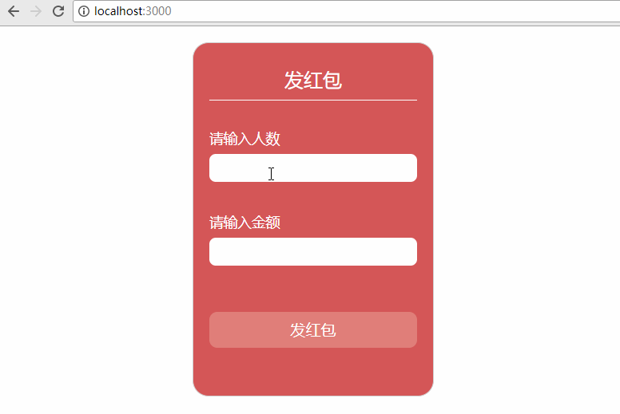

## 项目运行

```
git clone https://github.com/onlyliubara/small-red-bag.git
cd small-red-bag 
npm install
npm start
```

## 项目预览




## 实现功能

- 验证输入格式
- 设置每个红包的金额
- 找出最佳手气

## 现存问题

知道配色很丑...可能还会有很多很多bug...慢慢发掘哇！

### （写给自己看的）问题：

在将input作为react受控组件进行验证输入时，可以采取随时验证的方法，比如下面弹出个提示框，而不是弹出对话框。

想在`reducer`中对`action.people`和`action.money`进行处理后返回bags，但是并没有调用处理的函数，后来发现是解构赋值语法的问题啊...还是需要细心

发红包的时候要注意人多钱少的情况，要保证每个人最少会有0.01元。同时，由于使用的是`Math.random()`，所以会出现某个人领到0元的情况，要在这个时候为0元红包设置一个最小值。